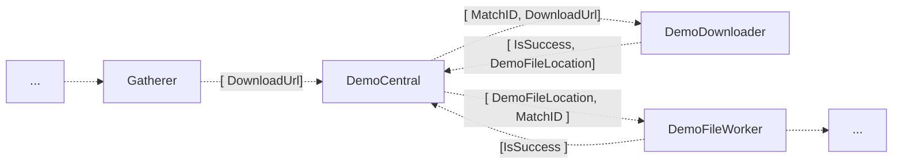

# README

DemoCentral orchestrates the entire CS:GO demo analysis. 

# Setup
Set all the required environment variables, see `Startup.cs`  

- `MYSQL_CONNECTION_STRING` : Connection string to [DemoCentral DataBase](/DataBase/README.md)
		<b> Set the connection string inside the `appsettings.json`
- `BLOBSTORAGE_CONNECTION_STRING` : connection to the blobstorage, only needs to include account credentials[\*]
- `MENTORINTERFACE_BASE_ADDRESS` : URI for MentorInterface. Specify "mock" to create an endpoint that always returns the lowest subscription

**AMQP**
- `AMQP_URI` : URI to the rabbit cluster[*]
- `AMQP_DEMODOWNLOADER` : Rabbit queue's name for producing messages to DemoDownloader[\*]
- `AMQP_DEMODOWNLOADER_REPLY` : Rabbit queue's name for consuming messages from DemoDownloader[\*] 
- `AMQP_MATCHWRITER_DEMO_REMOVAL` : Rabbit queue's name for producing messages to MatchWriter[\*] 
- `AMQP_MATCHWRITER_DEMO_REMOVAL_REPLY` : Rabbit queue's name for consuming messages from MatchWriter[\*] 
- `AMQP_DEMOFILEWORKER` : Rabbit queue's name for producing messages to DemoFileWorker[\*]
- `AMQP_DEMOFILEWORKER_REPLY` : Rabbit queue's name for consuming messages from DemoFileWorker[\*]
- `AMQP_GATHERER` : Rabbit queue's name for consuming messages from a Gatherer[\*]
- `AMQP_SITUATIONSOPERATOR_REPORT` : Rabbit queue's name for consuming messages from SituationsOperator[\*]
- `AMQP_MATCHWRITER_UPLOAD_REPORT` :  Rabbit queue's name for consuming upload statusreport messages from MatchWriter[\*]
- `AMQP_MANUALDEMODOWNLOAD` : Rabbit queue's name for consuming messages from ManualDemoDownloader[\*]
- `AMQP_FANOUT_EXCHANGE_NAME` : Rabbit's exchange name for the producing messagesto the fanout[\*]

# Flow
General flow of demo aquisition 

1. Get the DownloadUrl from the Gatherers
	<b> duplicate downloadUrl is checked
2. Send the Url to DemoDownloader
3. Get the DemoFileLocation from DemoDownloader
4. Send the DemoFileLocation to the DemoFileWorker
	<b> duplicate MD5 Hash is checked
5. Store the Success of DemoFileWorker

# Storage
DemoCentral has one [DataBase](/DataBase/README.md) with two tables.
One for storing general demo info, the other for storing every demo currently enqueued.

# HTTP 
DemoCentral has two sets of HTTP controllers.
One for public HTTP requests, like the MatchHistory or QueueStatus, the other, for private/trusted communication, example: the HashExchange.  
